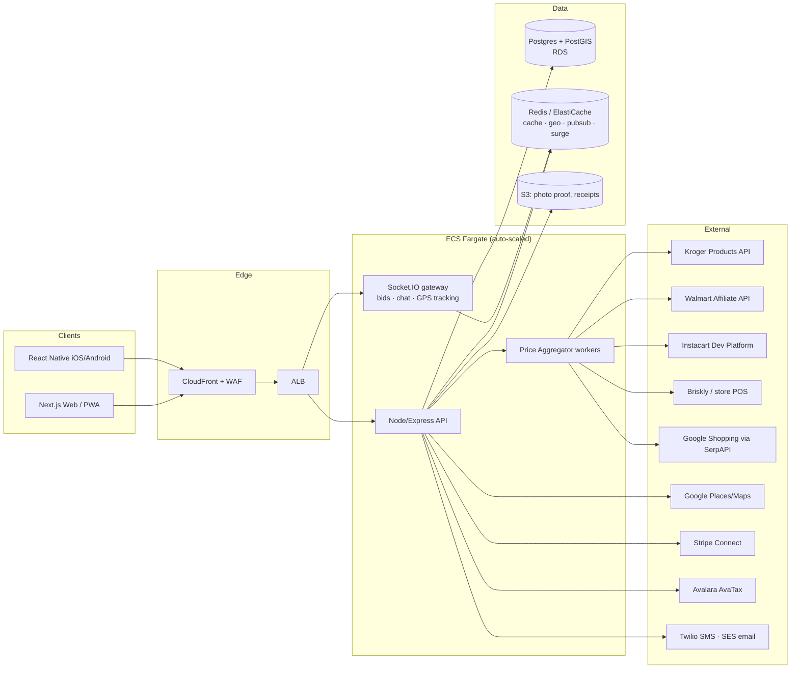
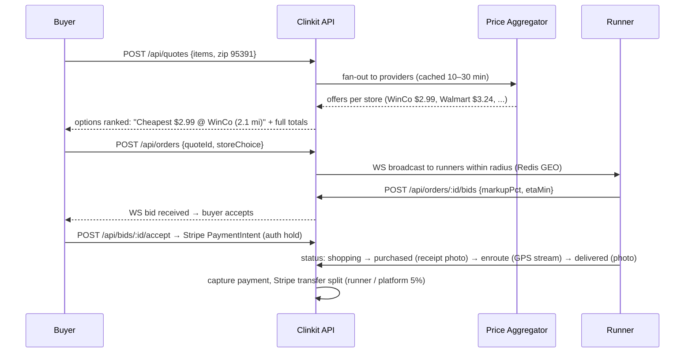
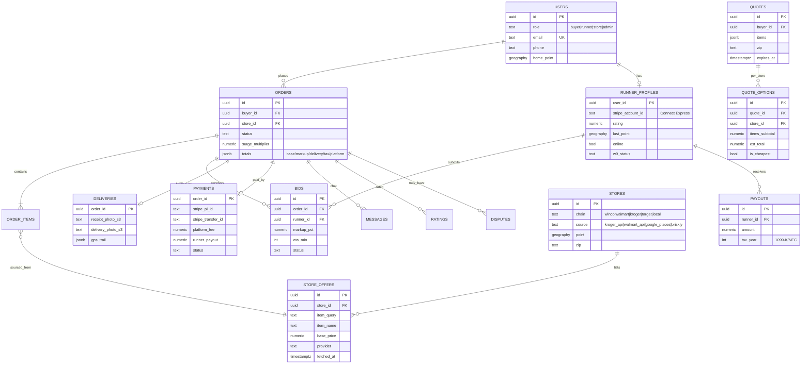

# Clinkit — Plan & Architecture (Phase 1)

**Clinkit** is a US hyperlocal marketplace: Buyers request items, Runners procure them from the
nearest/cheapest stores within a 5–10 mi radius and deliver in 10–60 minutes. The platform takes a
**5% cut**; Runners earn a **10% markup + surge**. The core differentiator is **live cross-store
price sourcing**: for any item, Clinkit compares real prices at Walmart, Target, WinCo, Kroger, and
local stores near the buyer's ZIP and surfaces "Cheapest: $2.99 @ WinCo" style options.

---

## 1. System overview



**Monorepo layout**

```
clinkit/
  docs/        # this plan, API integrations, design, compliance, deploy
  server/      # Node/Express + Socket.IO API (ESM, Node 22)
  web/         # Next.js 14 App Router (responsive web + PWA)
  mobile/      # Expo React Native (iOS/Android)
  infra/       # docker-compose, ECS/Terraform notes
```

---

## 2. Roles & core flows

| Role | Capabilities |
|---|---|
| **Buyer** | Search items/categories → see per-store price options (cheapest highlighted) → pick store or "cheapest" → place request → accept a Runner bid → live chat/track → rate |
| **Runner** | Go online (GPS) → nearby request alerts → bid (accept default 10% markup or adjust) → navigate to store → in-store procurement checklist → photo proof of receipt & delivery → paid via Stripe Connect |
| **Store** (optional) | Claim profile, publish deals/inventory hints via Briskly/POS feed |
| **Admin** | Disputes, refunds, 1099 exports, surge dashboard |

### Order lifecycle (state machine)

`draft → quoted → requested → bidding → matched → shopping → purchased → enroute → delivered → completed`
(+ `cancelled`, `disputed` from most states)

### Sequence — request → compare → bid → deliver



---

## 3. ERD



Full DDL in `server/src/db/schema.sql` (PostGIS for geo, indexes on `store_offers(item_query, fetched_at)` and GIST on geography columns).

---

## 4. Price sourcing strategy (the moat)

Order of preference per store chain — details in `02-API-INTEGRATIONS.md`:

1. **Kroger Products API** (official, OAuth2, real store-level price/availability — covers Kroger, Food 4 Less, Ralphs…)
2. **Walmart Affiliate/Developer API** (official product + price by store)
3. **Instacart Developer Platform** (multi-retailer catalog + fulfillment fallback; covers stores with no public API — e.g. Target via partner catalogs)
4. **Briskly / POS integrations** for opted-in local stores (true live inventory)
5. **Google Shopping (SerpAPI/DataForSeo)** — legal SERP-API fallback for chains with no API (**WinCo**, local groceries); returns local in-stock price by ZIP
6. **Google Places** — discover local stores in radius; price via crowd/runner confirmation ("price verified by runner 2h ago")

No scraping of sites whose ToS forbids it; only licensed SERP APIs. Every price is stamped `provider + fetched_at + confidence` and cached in Redis (TTL 10–30 min) keyed `offer:{zip}:{normalized_query}`.

**Comparison engine** (`server/src/core/comparison.js`): normalize item names → unit-price normalize (per oz/each) → filter radius 5–10 mi → rank by *effective buyer price* (base + runner markup + est. fees) → tag `cheapest`, `fastest`, `preferred`.

---

## 5. Money math

For each order (see `core/pricing.js`, all cents-safe):

```
items_base      = Σ store base prices (chosen store)
runner_markup   = items_base × (runner_bid_pct, default 10%) × surge_multiplier (1.0–2.5)
delivery_fee    = $3.99 base + $0.75/mi beyond 3 mi   (waived promo-able)
tax             = Avalara AvaTax on taxable lines (grocery exemptions per state)
buyer_total     = items_base + runner_markup + delivery_fee + tax
platform_fee    = 5% × (items_base + runner_markup + delivery_fee)   ← Clinkit cut
runner_payout   = items_base(reimbursed) + runner_markup + delivery_fee − platform_fee
```

Stripe Connect (Express accounts): PaymentIntent on buyer with `application_fee_amount = platform_fee`, destination charge → runner account. Surge from Redis demand/supply ratio per geohash (see `core/surge.js`).

---

## 6. Tech stack & scaling

| Layer | Choice | Why |
|---|---|---|
| Web | Next.js 14 (App Router), PWA manifest | SSR for SEO, one codebase responsive |
| Mobile | Expo React Native | iOS+Android, OTA updates, shared TS logic |
| API | Node 22 / Express (ESM) + Socket.IO | Team skill, WS-native, cheap |
| DB | Postgres 16 + PostGIS (RDS) | Geo queries, JSONB totals |
| Cache/RT | Redis (ElastiCache) | price cache, `GEOSEARCH` runner matching, Socket.IO adapter, surge counters |
| Payments | Stripe Connect Express | splits, 1099-K generation, KYC |
| Tax | Avalara AvaTax | US sales-tax by line/state |
| Infra | ECS Fargate + ALB + CloudFront, S3, SQS for aggregator jobs | low-ops, scale-to-demand |
| Obs | CloudWatch + Sentry | |

Cost posture (MVP): 2× Fargate 0.5 vCPU, db.t4g.small, cache.t4g.micro ≈ **$120–180/mo** before traffic.

---

## 7. Build phases

1. **P0 (this repo)** — quotes/compare engine, orders+bids over WS, Stripe/Avalara adapters (mock-able), web buyer flow + runner dashboard, RN scaffold, tests.
2. **P1** — real API keys (Kroger, Walmart, SerpAPI), Stripe live onboarding, photo proof S3 uploads, push notifications.
3. **P2** — Briskly/POS store onboarding, disputes console, surge tuning, ML substitution suggestions.
